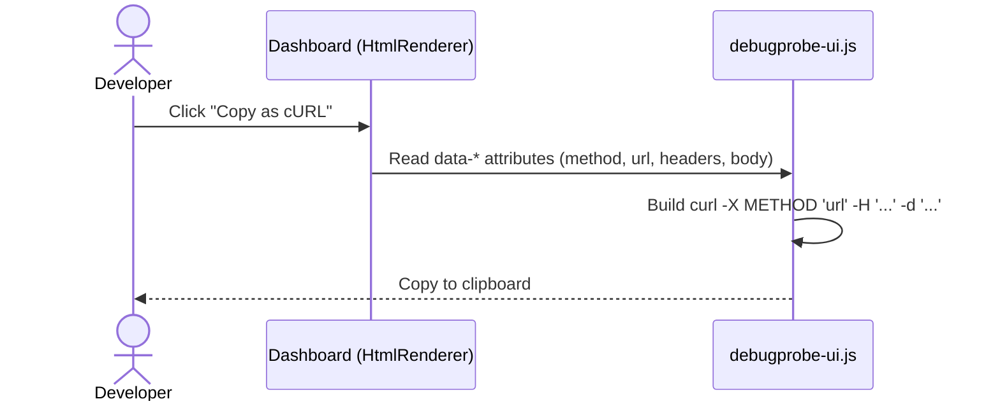
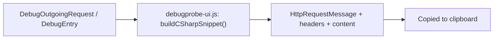
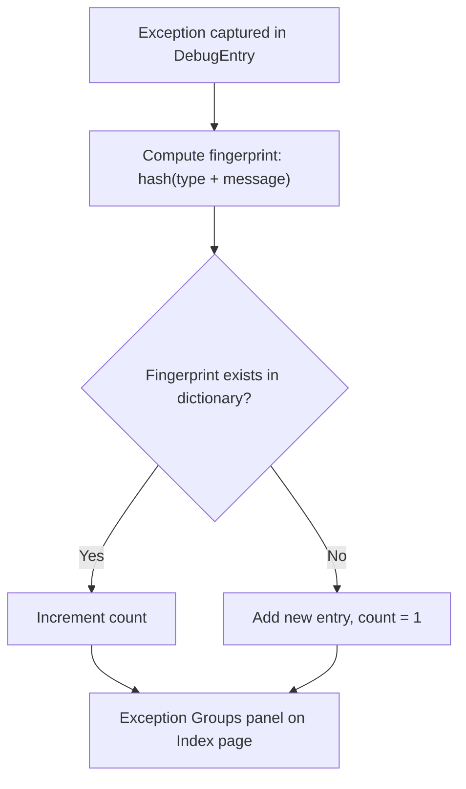
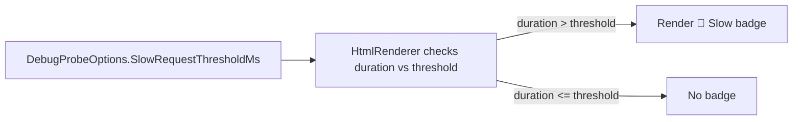
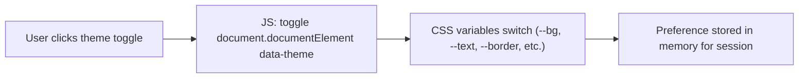
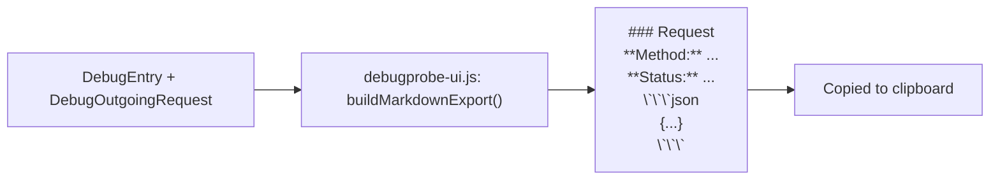
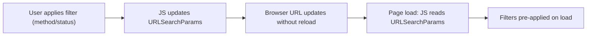

# DebugProbe.AspNetCore — 

This document proposes 7 lightweight features for `DebugProbe.AspNetCore`. Every feature reuses the existing architecture (`DebugEntryStore`, `HtmlRenderer`, `DebugEntry`, `DebugOutgoingRequest`) — **no new external dependencies, no database, no infra**. Advanced capabilities (dashboards, analytics, storage, management) remain out of scope for the package and are deferred to `DebugProbe.Server`.

---

## 🎯 Why These Features?

Every feature below passes three filters:

1. **Zero new infra** — no EF Core, no external DB, same in-memory `DebugEntryStore` philosophy.
2. **Immediate developer value** — usable the moment it ships, no configuration overhead.
3. **Reuses existing data** — everything needed is already captured in `DebugEntry` / `DebugOutgoingRequest`.

---

## 🗺️ Feature Overview

1. cURL Export
2. Copy as C# HttpClient Snippet
3. Exception Fingerprinting & Grouping
4. Slow Request / Dependency Badge
5. Dark / Light Theme Toggle
6. Markdown Export of a Trace
7. URL-Persistent Filters

---

## 1. cURL Export

**Why it matters:** A developer looking at a captured request in the dashboard often wants to test it themselves — right now that means manually rebuilding it in Postman or a terminal. A one-click "Copy as cURL" turns the dashboard from a viewer into a working tool.

**How it works:** `DebugOutgoingRequest` (and the incoming request on `DebugEntry`) already stores Method, URL, Headers, and Body. This is pure string templating on the client — no backend change required.



**Implementation notes:**
- Add `data-method`, `data-url`, `data-headers`, `data-body` attributes to request/response cards in `HtmlRenderer.RenderDetailsPage`.
- Add a `copyAsCurl(el)` function in `debugprobe-ui.js`.
- No new endpoint needed.

---

## 2. Copy as C# HttpClient Snippet

**Why it matters:** Most DebugProbe users are .NET developers. A cURL command still needs mental translation back into C#. A "Copy as C#" button generates a ready-to-paste `HttpClient` snippet — closing the loop for the exact audience using the package.

**How it works:** Same source data as cURL export (Method, URL, Headers, Body), just a different string template targeting C# syntax.



**Example output:**
```csharp
var request = new HttpRequestMessage(HttpMethod.Post, "https://api.example.com/orders");
request.Headers.Add("Authorization", "Bearer ...");
request.Content = new StringContent("{...}", Encoding.UTF8, "application/json");
var response = await httpClient.SendAsync(request);
```

**Implementation notes:**
- Shares the same data attributes as the cURL feature — one shared parsing function, two output templates.
- Zero backend involvement; pure client-side generation.

---

## 3. Exception Fingerprinting & Grouping

**Why it matters:** When something breaks, developers currently scroll through a flat list of exceptions one at a time. Grouping identical/similar exceptions (same type + message) into a single count immediately surfaces "this is happening a lot" versus "this happened once."

**How it works:** `DebugEntry` already captures exception type and message. A lightweight fingerprint (hash of type + normalized message) is computed and tallied in a `ConcurrentDictionary<string, int>` inside `DebugEntryStore` — no new storage layer, same in-memory model.



**Implementation notes:**
- Add `ConcurrentDictionary<string, ExceptionGroup>` to `DebugEntryStore`, updated alongside the existing `ConcurrentQueue`.
- `ExceptionGroup` = `{ Fingerprint, Type, SampleMessage, Count, LastSeen }`.
- Render as a small summary panel above the request table in `HtmlRenderer.RenderIndexPage`.

---

## 4. Slow Request / Dependency Badge

**Why it matters:** Spotting a slow request currently requires reading a duration column carefully. A visual badge makes performance problems jump out at a glance — both for the parent request and for individual outgoing dependencies inside the waterfall.

**How it works:** `HtmlRenderer` already computes durations for both the incoming request and each `DebugOutgoingRequest`. A configurable threshold (`SlowRequestThresholdMs`) decides when to render a "🐢 Slow" badge.



**Implementation notes:**
- New option: `SlowRequestThresholdMs` (default e.g. `1000`) in `DebugProbeOptions.cs`.
- Apply the same check inside the waterfall bar rendering (Phase 1/2) so slow **dependencies**, not just slow requests, get flagged.
- CSS-only badge styling, no JS required.

---

## 5. Dark / Light Theme Toggle

**Why it matters:** The dashboard is used during active debugging sessions, often for long stretches. Letting developers pick their preferred theme is a small but consistently appreciated quality-of-life feature — and it's practically free, since `debugprobe.css` already uses CSS variables for theming.

**How it works:** A toggle button flips a `data-theme` attribute on the root element; CSS variables already defined for the dark waterfall/tooltip styling are extended to cover the full page.



**Implementation notes:**
- Extend existing CSS variables in `debugprobe.css` to cover light + dark palettes.
- Add toggle button to `layout.html`.
- Since browser storage is out of scope for a minimal package, keep the preference session-only (resets on reload) — or optionally persist server-side via a query param, matching the "no localStorage" constraint if applicable to this environment.

---

## 6. Markdown Export of a Trace

**Why it matters:** Developers regularly need to paste request/response details into a GitHub issue, PR description, or Slack message. A "Copy as Markdown" button generates a clean, readable block instead of a messy screenshot or manual copy-paste.

**How it works:** Pure string templating from data already rendered on the details page (headers, body, status, duration, outgoing calls).



**Example output:**
```markdown
### POST /api/orders — 500 (1.84s)

**Request Body:**
​```json
{ "orderId": 123 }
​```

**Response Body:**
​```json
{ "error": "Timeout" }
​```
```

**Implementation notes:**
- Reuses the same data source as cURL/C# export — three export formats, one shared data-reading function.
- No new endpoint; entirely client-side.

---

## 7. URL-Persistent Filters

**Why it matters:** The index page already supports filtering by method/status, but the filtered view disappears on refresh and can't be shared. Reflecting filters in the URL query string turns a local filter into a shareable, bookmarkable link — useful for pointing a teammate straight at "all 5xx errors on staging."

**How it works:** Pure frontend change — existing filter JS reads/writes `URLSearchParams` on filter change and on page load.



**Implementation notes:**
- Update `debugprobe-ui.js` filter handlers to call `history.replaceState` with updated query params.
- On `DOMContentLoaded`, read `window.location.search` and apply filters before rendering the table.
- No backend involvement — `/debug` endpoint stays the same, filtering remains client-side.

---

## ➕ Additional Features (Phase 2)

### UI/UX

**8. Keyboard Shortcuts**
`/` to focus search, `Esc` to close details view, `c` to copy cURL for the focused request. Pure JS `keydown` listeners on `debugprobe-ui.js`, no backend involvement.

**9. Pin / Favorite a Trace**
Server-side boolean flag added to `DebugEntry` (in-memory only, resets with the queue). Pinned entries stay visible at the top of the index table regardless of the bounded queue eviction order.

**10. Redaction Preview Toggle**
A toggle on the details page that reveals the pre-redaction values for dev/local environments only — gated by `EnvironmentUtils`, no change to the redaction pipeline itself.

### Meta / Telemetry

**11. Request Rate Sparkline**
Small inline SVG/canvas chart on the index page showing request count per minute over the last N minutes. Computed by aggregating timestamps already present in `DebugEntryStore` — no new capture logic.

**12. Environment Diff Badge**
When the same endpoint returns a different response across environments, a small badge surfaces the mismatch. Reuses the existing `DebugEntryComparer` logic already built for the compare feature.

**13. Error Rate Trend Indicator**
A simple ↑ / ↓ arrow next to the existing error rate metric on the index page, comparing the current window to the previous one. Pure aggregation over already-stored entries.

### Safety Nets

**14. Replay Warning for Non-GET**
Before firing a replay on a POST/PUT/DELETE request, show a confirmation modal: "⚠️ This may re-trigger a real action." Applies only if a replay feature is implemented later; otherwise this is a placeholder guard for that future capability.
