# Day 1 — Waterfall/Timeline View (Phase 1) Implementation
 
**Date:** July 3, 2026
**Branch:** `feature/waterfall-view-phase1`
**Repo:** DebugProbe.AspNetCore
 
---
 
## The Problem
 
DebugProbe (a request-tracing/debugging dashboard for ASP.NET Core apps) showed outgoing HTTP dependency calls as a flat list only:
 
```
Restaurant API → 800ms
Payment API → 400ms
Delivery API → 600ms
```
 
This tells you *how long* each call took, but not *when* it started relative to the others — so there was no way to tell at a glance whether calls ran sequentially, in parallel, or where the actual bottleneck was.
 
## What We Built
 
A **Waterfall/Timeline view** — a simple, server-rendered horizontal bar per outgoing call, positioned and sized proportionally within the parent request's total duration. One glance at the bars tells you which call is the bottleneck.
 
**Scope decision:** Phase 1 = simple CSS bars only. No JavaScript, no tooltips, no zoom — matching the existing architecture where every dashboard element is server-rendered HTML styled with CSS classes.
 
## Implementation Steps (in order)
 
1. **Wrote a detailed implementation plan** first — identified exactly which files needed to change and why, before touching any code.
2. **Created a new branch** — `feature/waterfall-view-phase1` — kept off `main`.
3. **Confirmed existing data was sufficient** — checked `DebugOutgoingRequest.cs` and found the timing data needed for the waterfall (start time, duration) was already being captured by the existing middleware/handler. **Zero changes needed to data-capture code.**
4. **Added `BuildWaterfallSection(DebugEntry entry)`** in `HtmlRenderer.cs` — computes `left%` / `width%` per outgoing call relative to total request duration, clamped to 0–100% to avoid edge-case rendering bugs, using `InvariantCulture` formatting so percentages always use `.` regardless of server locale.
5. **Wired it into `RenderDetailsPage`**, placed above the existing outgoing-request cards (which stayed completely unchanged).
6. **Added CSS classes** to `debugprobe.css`: `.waterfall-container`, `.waterfall-row`, `.wf-label`, `.wf-track`, `.wf-bar`, `.wf-bar--error` (for failed calls), plus a mobile clamp for smaller screens.
**File scope stayed disciplined the whole way through:** only `HtmlRenderer.cs` and `debugprobe.css` were touched. No middleware, no storage, no HTTP handler changes.
 
## Testing & Verification
 
- **Automated:** `dotnet test` → 61/61 passing, no regressions.
- **Manual, end-to-end:** Used the `DemoController.ExecuteExternalRequests` endpoint in the sample API (makes 2 sequential outgoing calls to `jsonplaceholder.typicode.com`) to generate real multi-call trace data, then inspected the rendered `/debug/{id}` page.
### Real result
 

 
*Screenshot above: `/debug/{id}` details page showing the rendered waterfall for `POST /Demo/ExecuteExternalRequests`.*
 
- 2 waterfall rows rendered — one per outgoing call
- First call (`POST /posts`, 3844ms) → long bar starting at the left
- Second call (`GET /users`, 256ms) → short bar, correctly offset to the right — accurately reflecting that the calls ran **sequentially**, not in parallel
- Bars are proportional to actual duration relative to total request time (4361ms)
- Labels truncate cleanly with ellipsis
- Existing outgoing-request cards below the waterfall stayed fully intact
### Visualized as a timeline (actual test data)

```mermaid
gantt
    title Waterfall — POST /Demo/ExecuteExternalRequests (Total: 4361ms)
    dateFormat X
    axisFormat %Lms
 
    section Outgoing Calls
    POST /posts (3844ms)   :active, a1, 0, 3844
    GET /users (256ms)     :active, a2, 4105, 4361
```
 

 
This is exactly what the rendered bars communicate visually on the details page: the `POST /posts` call dominates the timeline (0ms → 3844ms), then `GET /users` runs afterward (4105ms → 4361ms) — with a small ~261ms gap between them representing overhead outside the two tracked calls (e.g. `ReadAsStringAsync` on the first response before the second call starts). This sequential pattern was invisible in the old flat-list view and is now obvious at a glance.
 
## Code Quality Pass (same day, same file scope)
 
After the feature worked, did a dedicated polish pass — **no new features added**, only tightened what already existed:
 
- Verified HTML-escaping was already correct (reused existing `Encode()` helper).
- Simplified a redundant null-check to match the file's existing convention (the collection is never null by contract).
- Extracted `0.0` / `100.0` clamp bounds into named constants (`MinPercent`, `MaxPercent`), matching the `const` pattern already used elsewhere in the file.
- Fixed a small duration-text inconsistency (`3844ms` → `3844 ms`) to match formatting used everywhere else on the page.
- Deliberately **did not** add an XML doc comment to the new method, since no other private method in the file has one — staying consistent with the existing convention mattered more than adding documentation for its own sake.
## Result
 
Phase 1 shipped clean: minimal diff, zero regressions, verified both visually and programmatically, ready for PR review. Tooltips/zoom/gridlines intentionally deferred as a Phase 2 proposal, pending maintainer feedback on this simpler version first.
 
**Branch pushed:** `feature/waterfall-view-phase1` → PR opened for review.
