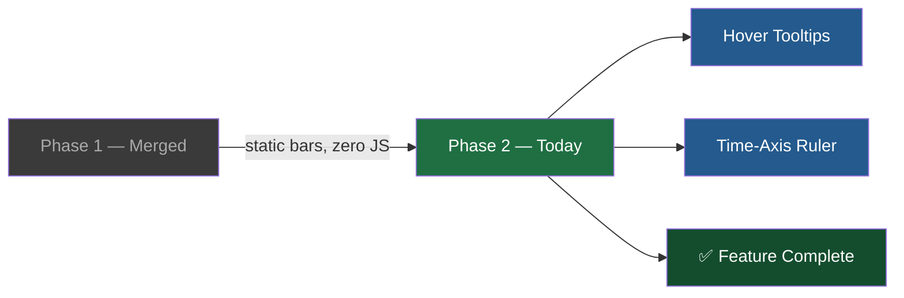
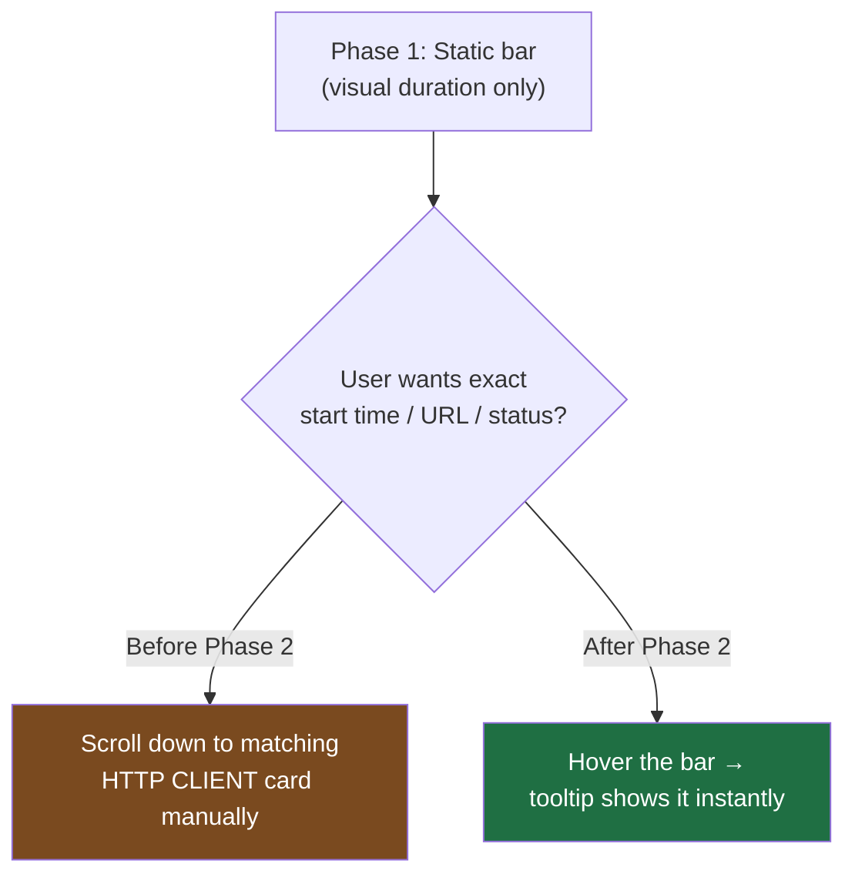
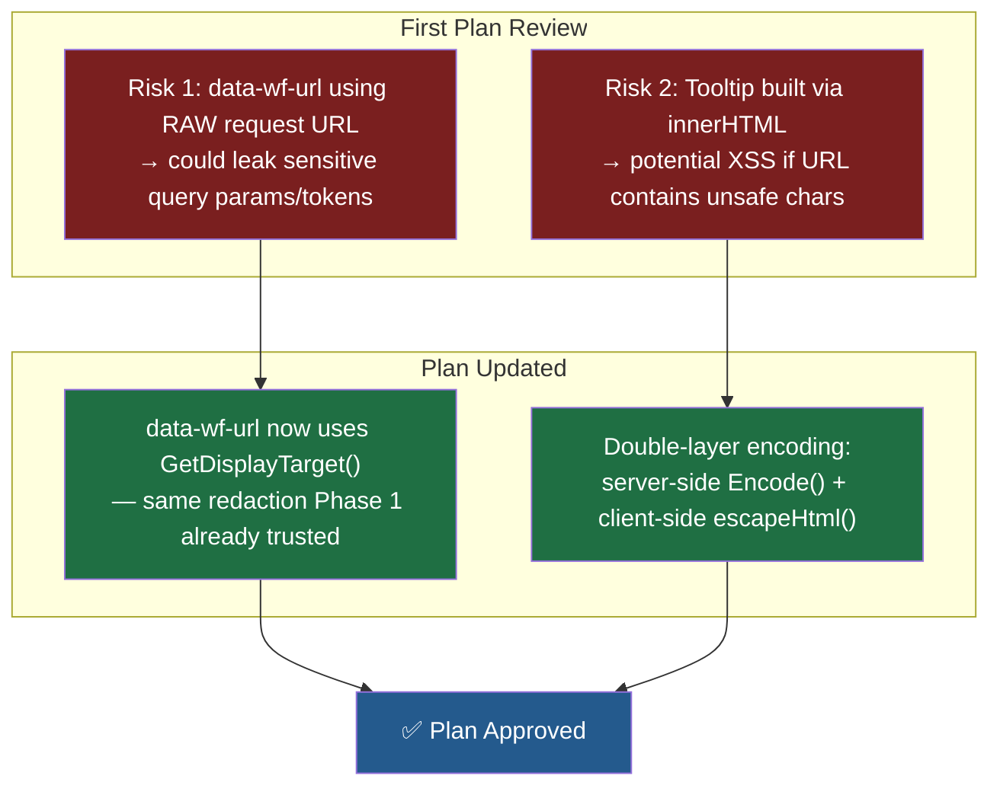
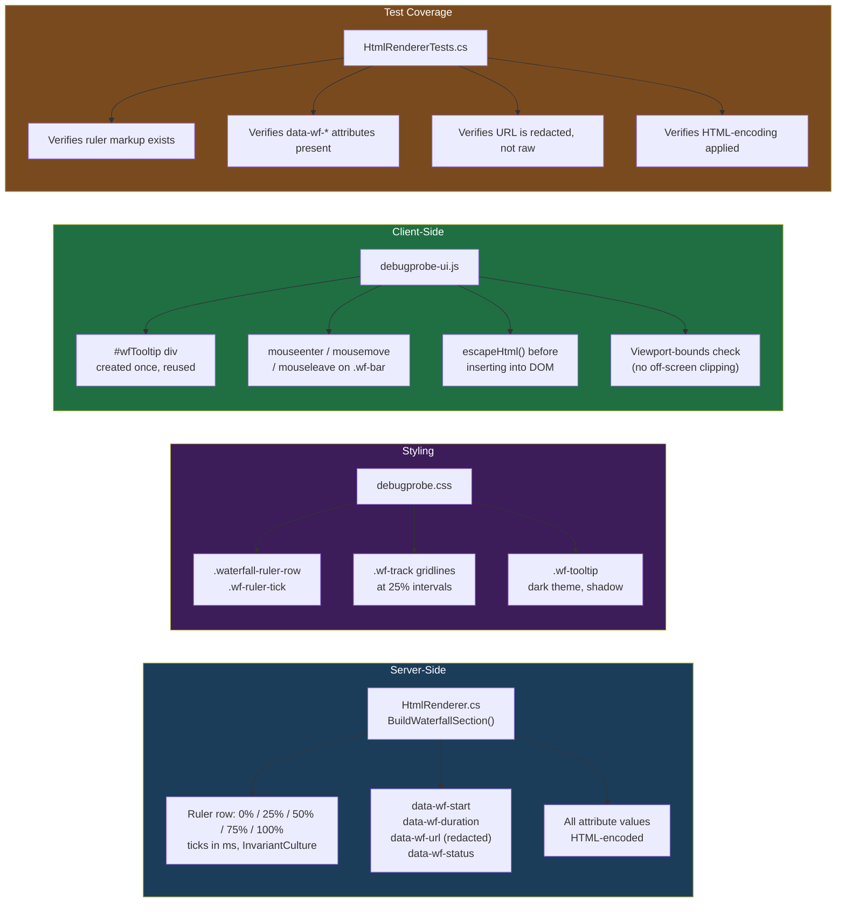
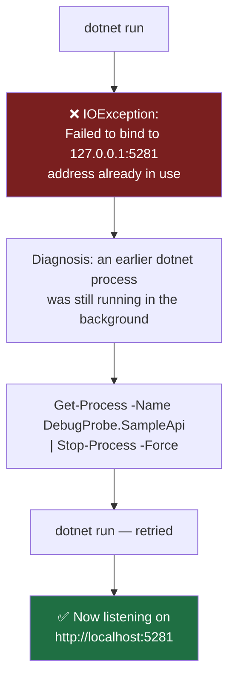
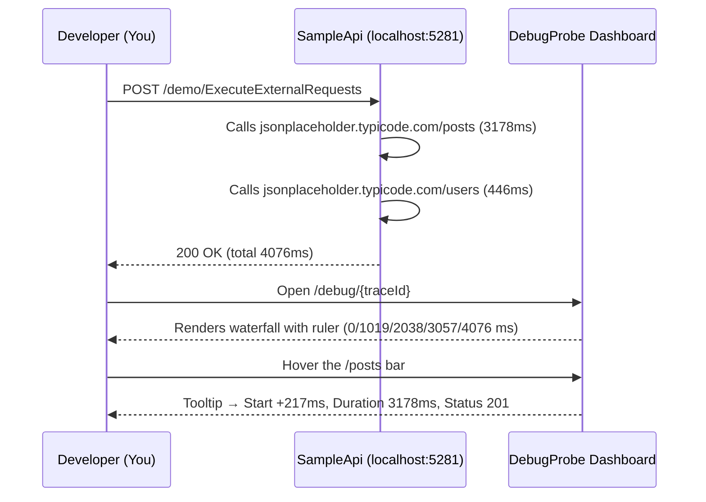
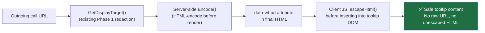
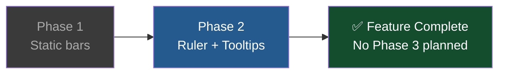

# Waterfall/Timeline View — Phase 2 Implementation Journey

**Project:** DebugProbe.AspNetCore
**Feature:** Interactive Waterfall Timeline — Hover Tooltips + Time-Axis Ruler
**Date:** July 4, 2026
**Branch:** `feature/waterfall-view-phase2`
**Status:** ✅ Implemented, Manually Verified, Ready for PR — 

---

## 1. Context — Where We Started

Phase 1 (already merged to `main`) replaced DebugProbe's flat text list of outgoing
HTTP calls with static, server-rendered horizontal bars — a "waterfall" showing
proportional duration of each dependency call within a parent request.

Phase 1 was intentionally **non-interactive**: no tooltips, no ruler, no JS. The
goal of today's session was to plan, review, implement, and verify **Phase 2**,
which adds the interactive layer on top of that foundation.

**Decision:** Phase 2 is the final phase of the waterfall/timeline feature.
Zoom/pan was considered and deliberately dropped — the current feature set
(proportional bars + ruler + tooltips) fully solves the original problem
(spotting the bottleneck at a glance), so no further phase is planned.

---

## 2. The Full Day, As a Timeline

```mermaid
gantt
    title Today's Session — Phase 2 Waterfall Feature
    dateFormat  HH:mm
    axisFormat  %H:%M

    section Planning
    Wrote Phase 2 prompt for coding LLM        :done, p1, 09:00, 30m
    LLM proposed initial implementation plan   :done, p2, after p1, 20m
    Security review — URL redaction + XSS gap  :done, p3, after p2, 15m
    LLM updated plan with fixes                :done, p4, after p3, 15m
    Plan approved                              :milestone, done, m1, after p4, 0m

    section Implementation
    Branch created (feature/waterfall-view-phase2) :done, i1, after m1, 5m
    HtmlRenderer.cs — ruler + data attributes  :done, i2, after i1, 40m
    debugprobe.css — ruler + tooltip styles    :done, i3, after i2, 30m
    debugprobe-ui.js — tooltip event logic     :done, i4, after i3, 30m
    HtmlRendererTests.cs — new unit test       :done, i5, after i4, 20m

    section Verification
    Fixed local port-in-use error              :done, v1, after i5, 10m
    Ran app, hit /demo/ExecuteExternalRequests :done, v2, after v1, 10m
    Verified ruler + tooltip on /debug page    :done, v3, after v2, 15m
    Confirmed git status — only 4 files changed :done, v4, after v3, 5m

    section Shipping
    git add / commit / push                    :active, s1, after v4, 10m
    Detailed PR description written             :active, s2, after s1, 10m
```

---

## 3. The Problem We Were Solving (Recap)

A flat list tells you *how long* each call took, but not *when* it happened
relative to others, or exactly what the numbers mean without cross-referencing
the card below. Phase 2 closes that last gap — glance at a bar, hover it,
get every detail instantly.

---

## 4. Planning Phase — Catching Issues Before They Became Bugs

Before any code was written, the implementation plan was reviewed twice.
Two real risks were caught and fixed at the **planning** stage — which is far
cheaper than fixing them after code was written.

---

## 5. What Actually Got Built

**Files touched — exactly as scoped, nothing more:**

| File | Role |
|---|---|
| `HtmlRenderer.cs` | Renders ruler + embeds redacted, encoded data attributes |
| `debugprobe.css` | Ruler layout, gridlines, tooltip visual style |
| `debugprobe-ui.js` | Tooltip creation, hover events, safe DOM insertion |
| `HtmlRendererTests.cs` | Confirms markup, redaction, and encoding all present |

No middleware, storage, HTTP handler, or model files were touched — the
blast radius stayed exactly where Phase 1 left it.

---

## 6. The One Real Hiccup — And How It Was Solved

This wasn't a Phase 2 code bug — it was a leftover process from a previous run
still holding the port. Killing it and re-running fixed it immediately.

---

## 7. Manual Verification — Proof It Works

Steps taken to verify the feature end-to-end:

### Result Screenshot

The final rendered waterfall — ruler ticks scaled correctly to the 4076ms
total duration, and the hover tooltip showing exact start offset, duration,
and status for the `jsonplaceholder.typicode.com/posts` call:

**Confirmed working:**
- ✅ Time-axis ruler: `0 ms → 1019 ms → 2038 ms → 3057 ms → 4076 ms`
- ✅ Tooltip on hover: `Start: +217 ms`, `Duration: 3178 ms`, `Status: 201`
- ✅ Bars remain proportional and color-correct (green/success shown here)
- ✅ `git status` confirmed only the 4 intended files were modified

---

## 8. Security Posture — Why This Is Safe to Ship

Two independent safety nets — server-side encoding *and* client-side escaping —
mean a single missed edge case doesn't turn into an XSS or data-leak issue.

---

---

---

*Documented on July 4, 2026 — DebugProbe.AspNetCore, Waterfall Timeline feature (Phase 1 + Phase 2, final).*
