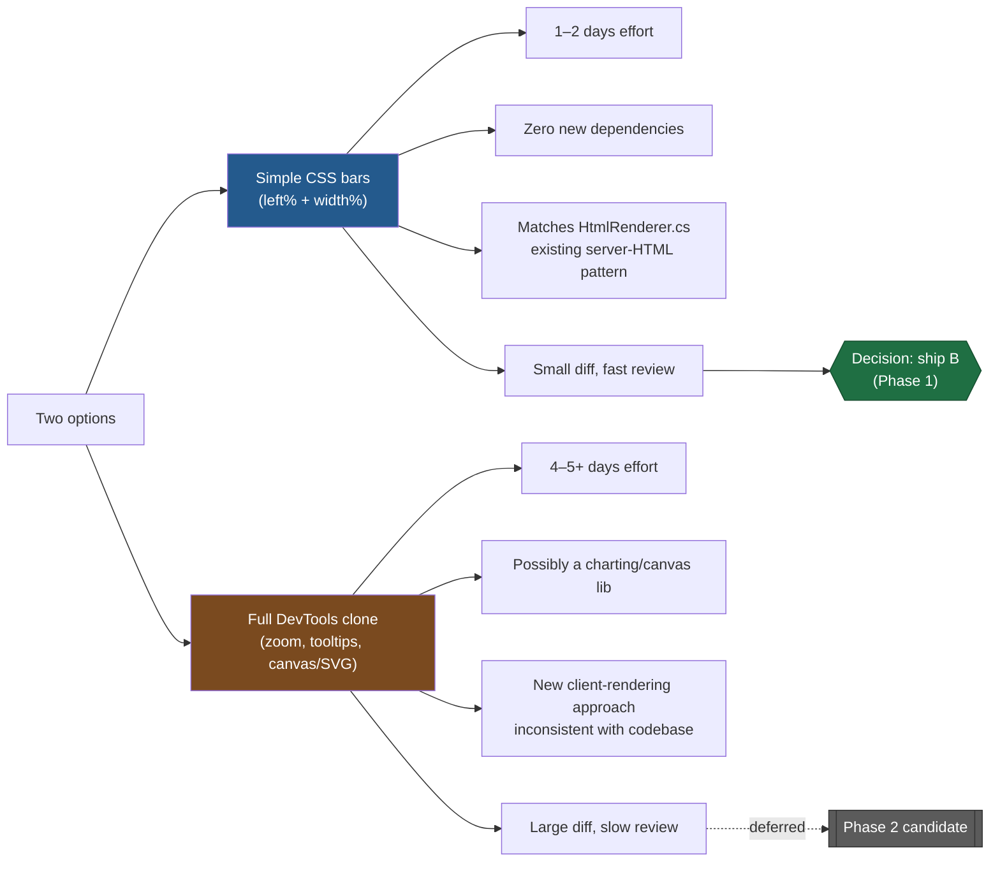
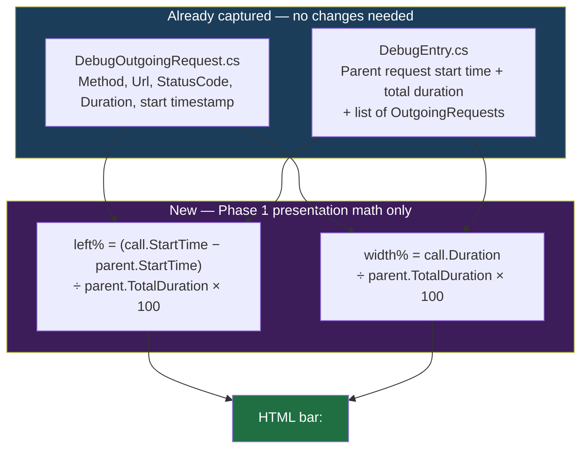
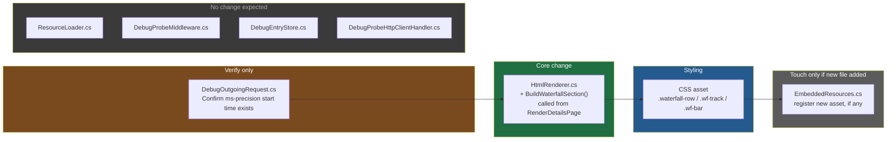
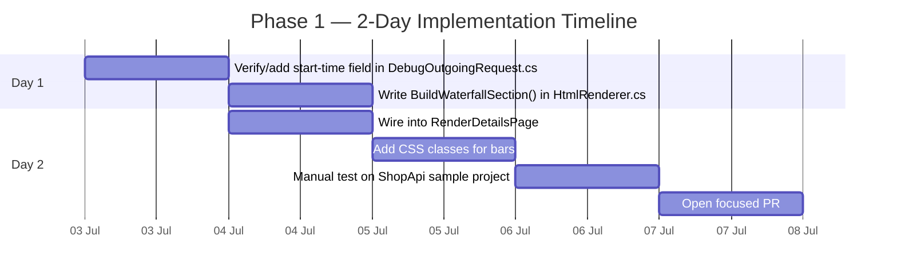
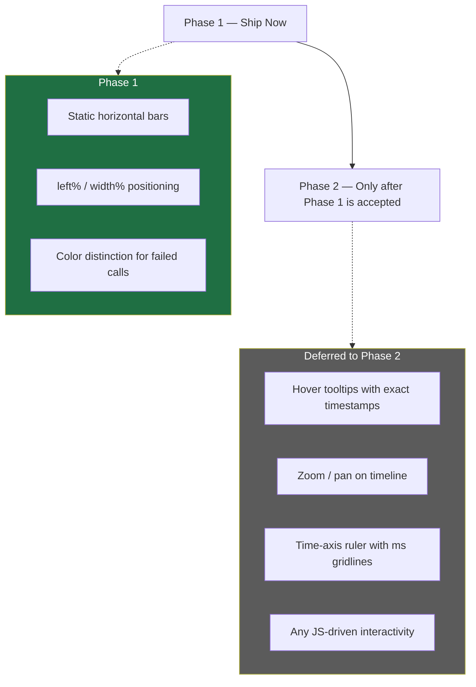

# Waterfall / Timeline View — Implementation Plan (Phase 1)

## 1. The Problem, Explained With a Real-Life Example

Imagine a food delivery backend. A single incoming request — "place an order" — internally triggers three outgoing calls:

1. Call the **Restaurant API** to confirm the order → takes 800ms
2. Call the **Payment API** to charge the customer → takes 400ms
3. Call the **Delivery API** to assign a rider → takes 600ms

Run sequentially, total time = 800 + 400 + 600 = **1800ms**.

Today DebugProbe captures all of this but shows it as a flat **list**:

```
- Restaurant API → 800ms
- Payment API → 400ms
- Delivery API → 600ms
```

A list tells you *how long* each call took, but not:
- **When** each call started relative to the others (sequential? parallel? overlapping?)
- **Which** call is the actual bottleneck at a glance
- **Where** the "dead time" is

### The same data, as a waterfall

```mermaid
gantt
    title Order Request — Outgoing Calls Timeline
    dateFormat X
    axisFormat %Lms

    section Order Request
    Restaurant API (bottleneck) :crit, restaurant, 0, 800
    Payment API                 :active, payment, 800, 400
    Delivery API                :delivery, 1200, 600
```



One glance at the chart tells you Restaurant API is the longest bar → it's the bottleneck. Text can't give you that "aha" instantly; a timeline can. **This is the entire value proposition of Phase 1.**

---

## 2. Scope Decision: Simple Bars vs. Full DevTools Clone



**Decision: Phase 1 ships simple CSS bars only.** This matches the existing pattern in `HtmlRenderer.cs`, where every dashboard element (`BuildTraceCard`, `BuildOutgoingRequestCard`, `BuildHeaderSection`) is a server-rendered HTML string with CSS classes — not client-side JS rendering. Hover-tooltips or zoom become a Phase 2 proposal only after the maintainer accepts the simple version.

---

## 3. What Data Already Exists (No New Data Collection Needed)

The most important reason this feature is low-risk: **the data waterfall needs is already being captured.**



So Phase 1 requires **zero changes to data capture** — `DebugProbeMiddleware.cs`, `DebugProbeHttpClientHandler.cs`, and `DebugEntryStore.cs` all stay untouched. No new algorithms, no new state, no persistence changes — just two percentages per call.

---

## 4. Files That Will Change, and Why



| File | Change | Why this file |
|---|---|---|
| `DebugOutgoingRequest.cs` | **Verify only** — confirm the stored timestamp is millisecond-precise and relative/convertible to the parent request's start time. Add one property only if missing. | This is the data source for the bar's position. If start-time isn't precise, the whole waterfall math breaks — check this before writing any UI code. |
| `HtmlRenderer.cs` | Add `BuildWaterfallSection(DebugEntry entry)` — loops `entry.OutgoingRequests`, computes `left%`/`width%`, returns HTML bar rows. Called from inside `RenderDetailsPage`, placed above the existing outgoing-request cards (which stay, unchanged). | This file already generates **all** dashboard HTML (`BuildTraceCard`, `BuildOutgoingRequestCard`, etc.). Keeping the waterfall here preserves the single-responsibility architecture instead of introducing a second rendering path. |
| CSS asset (via `EmbeddedResources.cs`) | Add `.waterfall-row`, `.wf-label`, `.wf-track`, `.wf-bar`, plus a `.wf-bar--error` modifier for failed calls. | Bars are pure CSS — a `<div>` with inline `left`/`width`, styled by these classes. No JS required. |
| `EmbeddedResources.cs` | **Likely no change** — only touched if CSS goes into a brand-new file instead of the existing stylesheet. | It's just a static cache of embedded text assets; only needs a new loader entry if a new file is introduced. |
| `ResourceLoader.cs` | **No change expected.** | Generic manifest-resource loader; unaffected unless the resource folder structure itself changes. |

**Blast radius:** 1 new method in `HtmlRenderer.cs`, a handful of new CSS rules, and a possible small property in `DebugOutgoingRequest.cs`. No middleware, no storage, no HTTP handler changes.

---

## 5. Step-by-Step Implementation Plan (Phase 1)



**Day 1**
1. Open `DebugOutgoingRequest.cs`, confirm start-time data exists at ms precision. Add a `StartedAt` field only if missing.
2. Write `BuildWaterfallSection` in `HtmlRenderer.cs`:
   - Guard clause: empty `OutgoingRequests` → return empty string (no empty section rendered).
   - Compute total timeline span from the parent request's duration.
   - Per call: compute `left%` / `width%`, clamp 0–100 to avoid edge-case rendering bugs.
   - Return one `<div class="waterfall-row">` per call — label, track, bar.

**Day 2**
3. Call `BuildWaterfallSection` from `RenderDetailsPage`, above the existing per-call cards.
4. Add CSS for `.waterfall-row` / `.wf-track` / `.wf-bar`, reusing the existing red/green status-code convention for failed calls.
5. Manually test on `ShopApi`: hit an endpoint with multiple outgoing calls, open `/debug`, confirm bars render proportionally and failed calls are visually distinct.
6. Open a small, focused PR — one render method, CSS additions, optional one model field. No JS, no new dependencies.

---

## 6. What's Explicitly Out of Scope for Phase 1



Proposing tooltips/zoom/gridlines now would inflate the PR and slow down review. They become natural, low-risk follow-ups once the maintainer has reviewed and accepted the simple version.
